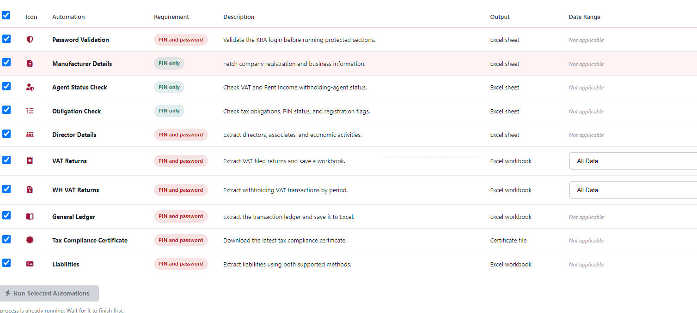

# KRA Audit Extractor - Consolidated Guide

This file combines the content that was previously spread across these Markdown files:

- `README-USER.md`
- `BUILD.md`
- `DESKTOP-APP-SUMMARY.md`
- `QUICK-FIX-GUIDE.md`
- `ECONNRESET-FIX-SUMMARY.md`
- `COMPANY-FOLDER-FIX-SUMMARY.md`
- `fix-tesseract-imports.md`
- `ARITHMETIC-RETRY-SUMMARY.md`
- `RUN-ALL-TABLE-SUMMARY.md`
- `automations/WORKBOOK_BEHAVIOR.md`
- The previous `COMPREHENSIVE-GUIDE.md`

## 1. Overview

KRA Audit Extractor is an Electron desktop application for working with Kenya Revenue Authority data. It supports company setup, credential validation, tax compliance review, multiple extraction workflows, Excel exports, PDF handling, batch-style automation, and company-specific output organization.

The app is intended to:

- automate common KRA portal review tasks
- reduce manual extraction work
- save outputs into structured company folders
- generate Excel workbooks and supporting files
- give a single interface for setup, review, and export

## 2. Main Capabilities

Core modules covered across the original documentation:

- Company setup and company detail lookup
- Password validation
- Manufacturer details
- Director details
- Obligation checking
- Withholding agent status
- Liabilities extraction
- VAT returns
- Withholding VAT returns
- General ledger extraction
- Tax compliance certificate download
- Run All automation flow
- PIN-only batch processing
- Full profile overview

Expected outputs include:

- consolidated Excel workbooks
- individual Excel workbooks where applicable
- PDF downloads such as tax compliance certificates
- JSON support files for some workflows

## 3. User Workflow

### 3.1 Quick Start

1. Launch the desktop app.
2. Go to Company Setup.
3. Enter the KRA PIN.
4. Enter the password only for password-protected workflows.
5. Fetch company details.
6. Optionally validate credentials.
7. Choose the required extraction or use Run All.
8. Review results and open the saved files or output folder.

### 3.2 Run All

Run All is intended to let the user select multiple automations from one table.

Important behavior documented across the original files:

- PIN-only tasks can run without a password.
- Password-protected tasks require the password.
- VAT and WH VAT support per-row date range selection.
- Agent Status and Tax Compliance were added into the Run All table.
- The table layout replaced older card-based selection so the user can scan all options at once.

Run All table columns described in the earlier docs:

- checkbox
- icon
- automation name
- requirement
- description
- output
- date range

Reference screenshot assets from the old Run All summary remain under:

- `image/RUN-ALL-TABLE-SUMMARY/`

## 4. Architecture

### 4.1 Stack

- Electron desktop shell
- renderer-side HTML, CSS, and JavaScript
- Node.js main process
- Playwright or browser automation modules
- ExcelJS for Excel generation
- OCR logic for arithmetic CAPTCHA handling

### 4.2 Process Structure

The application uses Electron IPC:

```javascript
ipcRenderer.invoke('handler-name', data);
mainWindow.webContents.send('event-name', data);
```

Renderer process responsibilities:

- tab navigation
- form state
- progress display
- result rendering
- toast notifications
- modal handling

Main process responsibilities:

- native dialogs
- filesystem operations
- open file and open folder actions
- launching automation modules
- sending progress events back to the renderer

## 5. Project Structure

The earlier guides consistently described the project around these files and folders:

```text
kra-audit-extractor/
|-- main.js
|-- index-new.html
|-- renderer-new.js
|-- styles-new.css
|-- toast-styles.css
|-- preload.js
|-- package.json
|-- automations/
|   |-- agent-checker.js
|   |-- director-details-extraction.js
|   |-- ledger-extraction.js
|   |-- liabilities-extraction.js
|   |-- manufacturer-details.js
|   |-- obligation-checker.js
|   |-- password-validation.js
|   |-- tax-compliance-downloader.js
|   |-- vat-extraction.js
|   |-- wh-vat-extraction.js
|   |-- shared-workbook-manager.js
|   `-- captcha-retry-helper.js
`-- dist/
```

## 6. Output and Workbook Behavior

One of the repeated themes in the Markdown files was output consistency.

### 6.1 Consolidated Workbook Behavior

Documented expected behavior:

- each company gets a company-specific folder
- individual automations append sheets into the same workbook when applicable
- the workbook is saved incrementally after each automation
- running multiple automations on the same company and same date should reuse the same consolidated workbook

Expected structure:

```text
Downloads/KRA POST PORTUM TOOL/
`-- COMPANY_NAME_PIN_DATE/
    |-- COMPANY_NAME_PIN_CONSOLIDATED_REPORT_DATE.xlsx
    |-- VAT_FILED_RETURNS_PIN_DATE.xlsx
    |-- WH_VAT_RETURNS_PIN_DATE.xlsx
    |-- DIRECTOR_DETAILS_PIN_DATE.xlsx
    |-- KRA-TCC-PIN-DATE.pdf
    `-- other exports
```

### 6.2 SharedWorkbookManager

The original documentation described `SharedWorkbookManager` as the common layer that:

- creates the company folder
- names the consolidated workbook
- reloads an existing workbook if it already exists
- adds or replaces sheets
- auto-fits columns
- saves after module completion

### 6.3 Company Folder Fix

The company-folder fix summary specifically documented that Tax Compliance Certificate downloads were brought into the same company-folder model as the other automations.

Before that fix:

- TCC files could land in the root download folder

After that fix:

- TCC files are stored inside the company folder
- result payloads include the company folder path for UI display

## 7. Automation Modules

### 7.1 Company Setup and Validation

Documented purpose:

- fetch company details from KRA-related endpoints
- verify the company context before running deeper automation
- validate credentials for password-protected flows

### 7.2 Manufacturer Details

Extracts business registration and manufacturer information such as:

- business name
- manufacturer name
- registration number
- contact details
- tax registrations
- eTIMS-related details

### 7.3 Director Details

Extracts:

- directors
- associates
- economic activities
- related registration details

### 7.4 Obligation Checker

Checks:

- PIN status
- iTax status
- eTIMS registration
- VAT compliance
- tax obligations and activity status

### 7.5 Agent Status

Checks withholding-agent related status, including VAT and rent withholding cases.

### 7.6 Liabilities

Extracts liabilities and balance-oriented information across supported tax types.

### 7.7 VAT and WH VAT

Supports:

- all-data mode
- custom month and year range mode
- workbook-style export output

### 7.8 General Ledger

Extracts ledger transactions and writes them to Excel output.

### 7.9 Tax Compliance Certificate

Downloads the latest certificate and exposes file actions in the UI.

## 8. CAPTCHA and OCR Notes

Two different Markdown files focused on CAPTCHA handling improvements.

### 8.1 Arithmetic Retry Logic

The documented retry model:

- detect arithmetic CAPTCHA failures
- retry automatically up to three times
- log attempts clearly
- return a readable error if retries are exhausted

Helper functions described in the original summary:

- `solveArithmetic(text)`
- `withCaptchaRetry(fn, maxRetries, progressCallback)`
- `hasArithmeticError(page)`

Suggested update pattern from the original docs:

```javascript
const { solveArithmetic, withCaptchaRetry, hasArithmeticError } = require('./captcha-retry-helper');
```

Then replace inline arithmetic logic with:

```javascript
const result = solveArithmetic(text);
```

And wrap CAPTCHA solving with:

```javascript
const captchaResult = await withCaptchaRetry(
    async () => await solveCaptcha(page, progressCallback),
    3,
    progressCallback
);
```

### 8.2 Tesseract Import Pattern

The earlier `fix-tesseract-imports.md` documented a production-safe import pattern:

```javascript
let createWorkerFunc;
try {
    const config = require('../tesseract-config');
    createWorkerFunc = config.createConfiguredWorker;
} catch (e) {
    const { createWorker } = require('tesseract.js');
    createWorkerFunc = createWorker;
}
```

Then replace direct `createWorker` usage with `createWorkerFunc`.

Files previously called out for applying this pattern included:

- `vat-extraction.js`
- `ledger-extraction.js`
- `obligation-checker.js`
- `run-all-optimized.js`
- `wh-vat-extraction.js`

## 9. ECONNRESET Fix

Two separate docs covered this fix: a short quick-fix guide and a longer technical summary.

### 9.1 Problem

The packaged Electron application could fail HTTP requests with `ECONNRESET`, especially in production `.exe` builds.

### 9.2 Root Cause

The documented root cause was use of `node-fetch` inside packaged Electron builds, where SSL and certificate handling behaved differently than in development.

### 9.3 Fix

The solution documented in the repo:

- create `automations/electron-fetch-wrapper.js`
- use Electron's `net` module in packaged builds
- keep `node-fetch` in development when appropriate
- update affected modules to import the wrapper instead of importing `node-fetch` directly

Pattern described in the docs:

```javascript
const fetch = require('./electron-fetch-wrapper');
```

Affected files called out in the documentation:

- `automations/manufacturer-details.js`
- `automations/director-details-extraction.js`
- `main.js`

### 9.4 Test Flow

The original guides recommended:

1. rebuild the app
2. run the packaged executable
3. test company setup and any automation using HTTP requests

## 10. Build and Distribution

Three different Markdown files described the build and packaging story: `BUILD.md`, `DESKTOP-APP-SUMMARY.md`, and `README-USER.md`.

### 10.1 Build Commands

```bash
npm install
npm run build
```

Commonly documented outputs:

- `dist/KRA POST PORTUM TOOL Setup 1.0.0.exe`
- `dist/KRA POST PORTUM TOOL 1.0.0.exe`
- `dist/win-unpacked/`

### 10.2 Distribution Model

Supported packaging styles described in the docs:

- NSIS installer
- portable executable

### 10.3 Build Notes

Documented points:

- the app is already an Electron desktop app
- the remaining step is packaging for distribution
- admin privileges may be needed for browser automation
- app icon files are optional but recommended

### 10.4 Suggested Build Checklist

- install dependencies
- confirm app works in development
- verify package version
- optionally add icon assets
- build the installer
- test installer on a clean Windows machine
- test the portable build

## 11. User Guide Notes

The old `README-USER.md` covered end-user guidance.

### 11.1 System Requirements

- Windows 10 or 11
- 4 GB RAM minimum, 8 GB recommended
- internet access
- enough disk space for browser automation and exports

### 11.2 Best Practices

Do:

- validate credentials before protected runs
- choose sensible date ranges
- wait for extraction to finish before closing the app
- back up output files
- review the output folder after runs

Do not:

- close the app mid-process
- change context during long automation if the workflow depends on the active session
- use incorrect credentials repeatedly
- delete files while the app is still writing them

## 12. Troubleshooting Summary

Consolidated from the previous docs.

### 12.1 Login Failure

- verify PIN and password
- confirm internet access
- retry later if the KRA portal is unstable

### 12.2 Slow or Incomplete Extraction

- allow longer wait time
- reduce date ranges
- try a narrower period instead of all data

### 12.3 App Does Not Start

- reinstall dependencies or the packaged app
- check antivirus and firewall
- try a rebuild if the issue only appears in packaged mode

### 12.4 File Does Not Open

- check the file path still exists
- confirm the default application is available
- verify the export completed successfully

### 12.5 Build Failure

Typical recommendations documented earlier:

```bash
rm -rf dist/
rm -rf node_modules/
npm install
npm run build
```

On Windows this effectively means cleaning build output, reinstalling dependencies, and building again.

## 13. Development Notes

The original comprehensive guide included a template for adding a new automation:

1. create a module in `automations/`
2. add an IPC handler in `main.js`
3. add a UI trigger in `index-new.html`
4. wire the renderer event in `renderer-new.js`
5. send progress updates back to the UI
6. return structured result data and export paths

Recommended development practices repeated across the old docs:

- keep automation modules focused
- use progress callbacks
- wrap async operations in `try/catch`
- clean up browser resources in `finally`
- validate paths before file operations
- reuse shared helpers such as workbook and CAPTCHA logic

## 14. Notes From Removed Source Files

This section preserves the intent of each deleted Markdown file:

- `RUN-ALL-TABLE-SUMMARY.md`: documented the move from checkbox cards to a Run All table, including date range columns and added Agent Status and Tax Compliance rows.
- `README-USER.md`: end-user installation, quick-start, and support guide.
- `QUICK-FIX-GUIDE.md`: short operational summary of the packaged-app `ECONNRESET` fix.
- `fix-tesseract-imports.md`: production-safe Tesseract worker import pattern.
- `ECONNRESET-FIX-SUMMARY.md`: detailed technical explanation of the Electron-safe fetch wrapper.
- `DESKTOP-APP-SUMMARY.md`: high-level packaging and distribution status.
- `COMPANY-FOLDER-FIX-SUMMARY.md`: TCC output moved into company folders via `SharedWorkbookManager`.
- `BUILD.md`: developer build and packaging instructions.
- `automations/WORKBOOK_BEHAVIOR.md`: expected consolidated workbook and folder behavior for individual and grouped runs.
- `ARITHMETIC-RETRY-SUMMARY.md`: arithmetic CAPTCHA retry helper design and rollout notes.

## 15. Consolidated Status

Based on the removed documents, the intended project direction was:

- one desktop application
- one organized output structure per company
- one consistent workbook behavior for applicable automations
- one clearer Run All selection table
- one safer OCR and retry path for arithmetic CAPTCHA
- one production-safe HTTP strategy for packaged Electron builds
- one distribution story for installer and portable builds

This file now serves as the single Markdown reference for that material.
